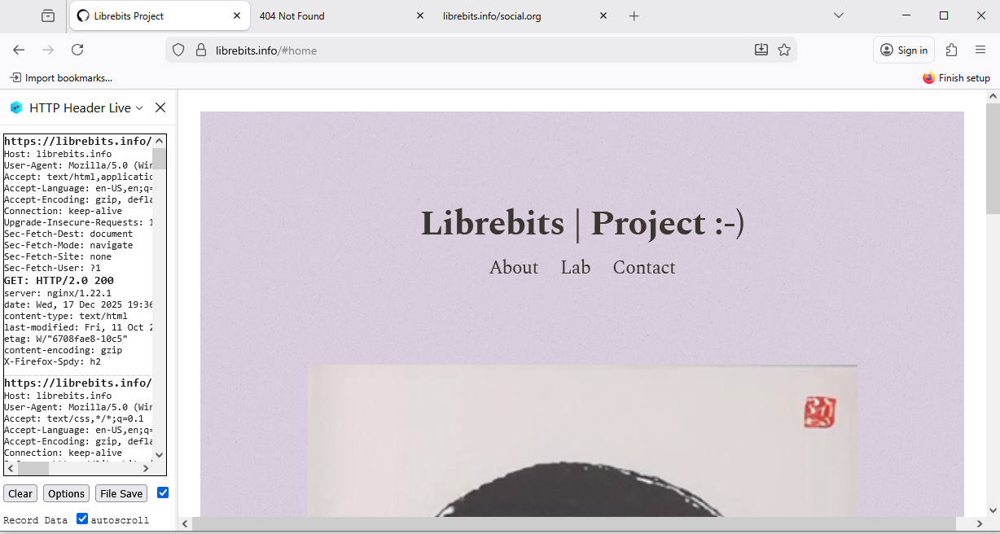
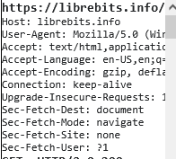
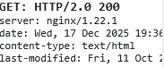
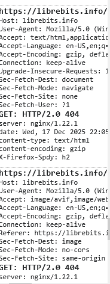
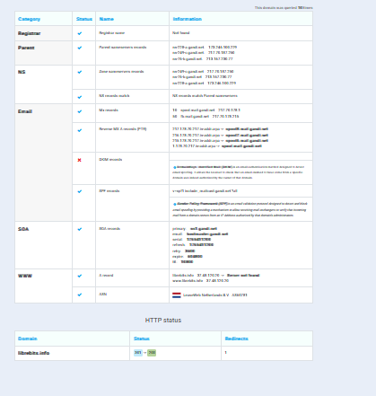
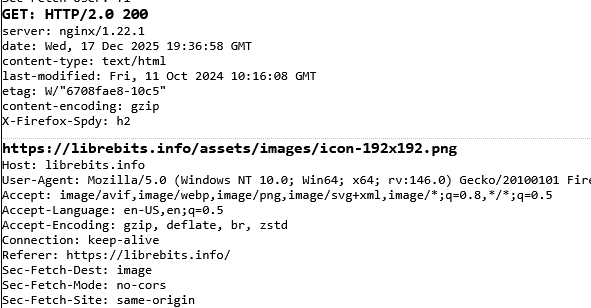
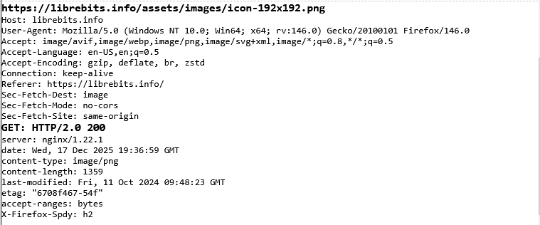

# Análisis de Captura HTTP

## 1. Datos de la Captura
* **Método HTTP:** `GET`
* **Ruta:** `/`
* **Protocolo:** `HTTP/2.0`
* **Dominio:** `librebits.info`

### Cabeceras principales:
* **Host:** `librebits.info`
* **User-Agent:** `Mozilla/5.0 (Windows NT 10.0; Win64; x64; rv:146.0) Gecko/20100101 Firefox/146.0`
* **Accept:** `text/html,application/xhtml+xml,application/xml;q=0.9,/;q=0.8`
* **Sec-Fetch-Mode:** `Maps`
* **Connection:** `keep-alive`

> **[]**

---

## 2. Explicación de los Elementos

### Método GET
El método **GET** sirve para solicitar información del servidor sin modificar nada. Es el más común para ver páginas web.

### Ruta (/)
La barra `/` significa que estamos pidiendo la página principal del sitio (normalmente `index.html`).

### HTTP/2.0
Es la versión del protocolo. **HTTP/2** es más rápido que HTTP/1.1 porque puede enviar varios archivos a la vez por la misma conexión.

### Host
Indica el dominio del servidor (`librebits.info`). Es obligatorio para que el servidor sepa qué página mostrar.

### User-Agent
Identifica el navegador y sistema operativo. En este caso: **Firefox 146** en **Windows 10**.

### Accept
Le dice al servidor qué tipos de archivos puede entender el navegador. Aquí pide principalmente HTML.

### Sec-Fetch-Mode
Es una cabecera de seguridad que indica cómo se inició la petición (en este caso indica navegación por mapas o similar según tu captura).

> **[]**

---

## 3. Respuesta del Servidor

* **Código:** `200 OK`
* **Servidor:** `nginx/1.22.1`
* **Content-Type:** `text/html`
* **Content-Encoding:** `gzip`

### ¿Qué significa cada cosa?
* **200 OK:** Todo fue bien, el servidor encontró la página y la envió correctamente.
* **nginx/1.22.1:** Es el software que usa el servidor web.
* **Content-Type (text/html):** Le dice al navegador que el archivo es una página web HTML.
* **Content-Encoding (gzip):** El servidor comprimió el archivo antes de enviarlo para que ocupe menos y llegue más rápido.

> **[]**

# Análisis de Captura HTTP: Errores 404 (Caso B)

Este análisis se basa en la captura , la cual muestra dos transacciones HTTP/2 distintas donde el servidor responde que no encuentra los recursos solicitados.

---

## 1. Primera Petición: Intento de Navegación (Documento)

La parte superior de la captura muestra la petición principal realizada por el navegador.

### Datos de la Solicitud (Request)
* **Host:** `librebits.info`
* **Método/Protocolo:** `GET HTTP/2.0` (Implícito en la primera línea de respuesta).
* **User-Agent:** `Mozilla/5.0 (Windows NT 10.0... Firefox/146.0)`
    * *Interpretación:* El cliente es un navegador Firefox (versión futura 146) en Windows 10.
* **Accept:** `text/html,application...`
    * *Interpretación:* El navegador indica que prefiere recibir un documento HTML (una página web).
* **Sec-Fetch-Dest:** `document`
    * *Interpretación Clave:* Indica que esta petición es para cargar la ventana principal del navegador (no es una imagen, ni un script, ni un estilo).
* **Sec-Fetch-Mode:** `Maps`
    * *Interpretación Clave:* Confirma que fue una acción de navegación iniciada por el usuario (por ejemplo, escribir la URL en la barra de direcciones o hacer clic en un enlace).

### Respuesta del Servidor (Response)
* **Estado:** `HTTP/2.0 404` (Not Found)
    * *Interpretación:* El servidor Nginx recibió la petición pero no encontró el archivo HTML en la ruta solicitada.
* **Server:** `nginx/1.22.1`
    * *Interpretación:* El servidor web está funcionando correctamente, es un software Nginx.
* **content-type:** `text/html`
    * *Nota:* Aunque la página solicitada no existe, el servidor envía un documento HTML, que usualmente es una página de error genérica o personalizada ("Oops, página no encontrada").

---

## 2. Segunda Petición: Fallo de Recurso (Imagen)

La parte inferior de la captura muestra una segunda petición que ocurre casi inmediatamente después de la primera.

### Datos de la Solicitud (Request)
* **Host:** `librebits.info`
* **Accept:** `image/avif,image/webp...`
    * *Interpretación Clave:* El navegador ahora está solicitando explícitamente un archivo de **imagen**.
* **Referer:** `https://librebits.i...` (Truncado)
    * *Interpretación:* Esta cabecera es crucial. Indica la página que *intentó* cargar esta imagen. Sugiere que la página anterior (incluso si dio error 404) tenía una etiqueta `` que apuntaba a este recurso.
* **Sec-Fetch-Dest:** `image`
    * *Interpretación:* Confirma que el destino del recurso es un contenedor de imagen en el navegador.

### Respuesta del Servidor (Response)
* **Estado:** `GET: HTTP/2.0 404`
    * *Interpretación:* El servidor buscó la imagen solicitada (ej. un logotipo o icono) y tampoco la encontró.

---

## 3. Diagnóstico General de la Captura

La imagen  **[]** ilustra un escenario de "enlaces rotos" múltiples:

---

## 4. Información DNS

### Registro A (Dirección IP)
* **IP del servidor:** `37.48.170.70`
* Conecta el nombre `librebits.info` con la dirección IP real del servidor.

### Servidores de Nombres (NS)
* **Gestionados por:** `gandi.net` (`nsa.gandi.net`, `nsb.gandi.net`, etc.)
* Son los servidores que controlan los registros DNS del dominio.

### Registros MX (Correo)
* También gestionados por `gandi.net`.
* Son los servidores que reciben los emails enviados a `@librebits.info`.

### Ubicación del Servidor
* **Proveedor:** LeaseWeb Netherlands B.V.
* **País:** Países Bajos

### Seguridad (SPF)
* Registro TXT con `v=spf1`.
* Evita que otros servidores puedan enviar correos haciéndose pasar por el dominio.

> ****

---

## 5. Tipos de Contenido (Content-Type)

### 
* **Qué es:** Una imagen en formato PNG.
* **Para qué sirve:** El navegador sabe que debe mostrar los datos como una imagen, no como texto.

> ****

### `text/css`
* **Qué es:** Un archivo de estilos CSS.
* **Para qué sirve:** El navegador lo usa para dar formato a la página (colores, fuentes, tamaños, etc.).

> ****

---

## Resumen
Esta captura muestra cómo un navegador solicita una página web:

1.  El navegador pide la página con **GET**.
2.  El servidor responde con código **200 (éxito)**.
3.  Envía el HTML comprimido con **gzip**.
4.  El DNS traduce `librebits.info` a la IP `37.48.170.70`.
5.  El servidor está en Países Bajos usando **nginx**.